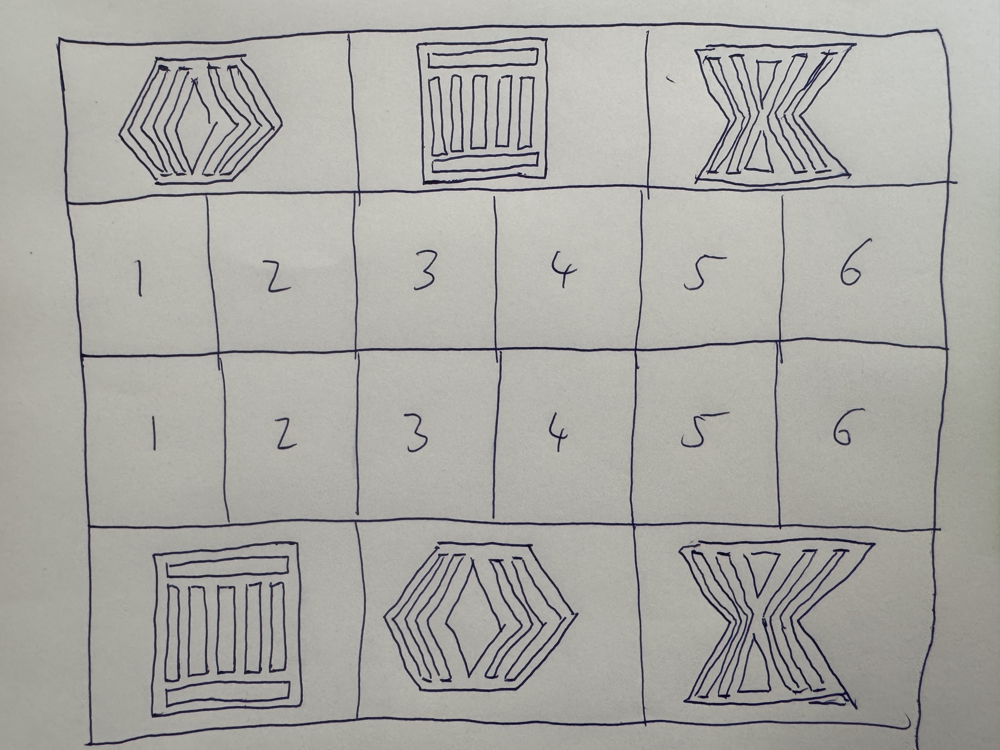
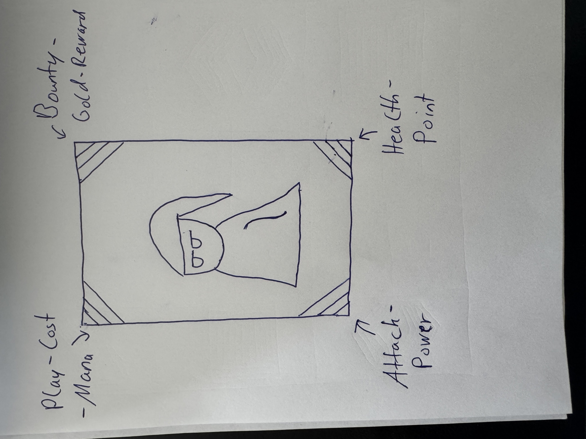

# Secrets, Room's & Travels' — The Card Game

A two-player tactical card game in which both players always play the same deck and nothing inside a match is written out: no numbers, no letters. Built with Godot 4.7 and C#; the rules live in an engine-free library with unit tests.

<!-- TODO: Screenshot (not presentable yet; add when it is) — the running board (src/Cardgame.Client, main scene BoardScreen) mid-match: a few units placed on both sides, one attack frame visible, hand in the left margin. A short GIF of playing a unit and attacking would say more than the still. -->

Hand-drawn concept of the board: two rows of six unit slots, a row of three totems behind each side.



## Status

Prototype, in active development, and a learning project in the sense that the design is worked out gate by gate (G00 to G10, see [`docs/ROADMAP.md`](docs/ROADMAP.md)). Gates G00, G01, G02 and G04 to G06 are done; G03 (a legibility test) was skipped on purpose; G07 (card effects) is next.

What exists:

- a local, hot-seat match on one screen: set up, hand, playing units at one of three tiers, attacking units and totems, turn clock, win condition (Totem of Life at 0);
- nine cards with rough, unbalanced values (`design/cards/`), one 20-card starter deck;
- three match modes: Shuffled Mirror, Perfect Mirror, Constructed.

What does not exist yet: card abilities beyond attack patterns (burn, poison, stun, healing are G07), the Merchant, Mastery Stats (parked), any networking or lobby (`src/Cardgame.Server` is an empty project shell, `src/Cardgame.Cli` prints a placeholder line), sound, and an exported build. The client reads its art from disk, which works from the editor but not yet in an export.

## The idea

Both players play the same deck, so the game is decided by three things only: which of three tiers you pay for when you play a card, where you place units, and how you use a clock that is part of the board.

Each side has six unit slots and three totems behind them. The Totem of Life is the win condition, the Totem of Mana is the mana pool, the Totem of Time is the turn clock and the end-turn button. A totem cannot be attacked while a unit stands in either of its two columns, so the arrangement of units matters, not just their number. Hitting a totem costs the opponent its resource: a hit on the Totem of Mana costs mana, a hit on the Totem of Time shortens their next turn.

What is unusual is the display rule. A card shows its play cost, bounty, attack and health as four coloured corner wedges, filled in up to four bands; a player reads values from colour and fill level. The totems are the HUD: segments light up or fade as the resource changes. A card-sized sketch of the layout:



The full rules are in [`docs/GAME_DESIGN.md`](docs/GAME_DESIGN.md). A debug overlay (key `D`) shows the numbers while developing.

## Controls

Taken from `BoardScreen.cs`, `CardControl.cs` and `TierPicker.cs`. The screen always belongs to the player whose turn it is (hot-seat).

| Input | Action |
|---|---|
| Left click on a hand card, then on a free own slot | Choose a card and where it goes |
| `1` / `2` / `3` or click | Choose the tier in the picker that opens (unaffordable tiers are dimmed) |
| Left click on an own unit, then on a framed target | Attack a unit or an unprotected totem |
| Right click or `Esc` | Cancel the selection |
| Click your Totem of Time or `Tab` | End the turn |
| `Q` | Switch between the two banks of four hand cards |
| `D` | Toggle the debug overlay with numbers |
| `P` | Pause the turn clock |
| `F` | Refill your mana (development helper) |
| `M` | Cycle the match mode and start a new match |
| `R` | New match with the next seed |

## Running it

Requirements: the Godot .NET build in version 4.7.1 (pinned in `src/Cardgame.Client/Cardgame.Client.csproj`) and the .NET 9 SDK.

1. Open `src/Cardgame.Client/project.godot` in the Godot editor.
2. Build the C# solution once and press Play; the main scene is `Presentation/BoardScreen.tscn`.

To build and run all tests without Godot:

```sh
./scripts/check.sh
```

It builds `game04.sln` and runs every test project with `dotnet test`. There is no exported build to download.

## Structure

```text
src/Cardgame.Core      rules: state, commands, events, systems, snapshots, seeded RNG; no Godot reference
src/Cardgame.Assets    reads vector assets and turns them into drawable geometry; also engine-free
src/Cardgame.Client    the Godot client: layout, drawing, animation, input
src/Cardgame.Server    placeholder for the lobby and match runner (empty)
src/Cardgame.Cli       placeholder for a headless match runner
tests/                 xunit tests for Core and Assets, plus shared fixtures
design/                card, ability and deck data as JSON, asset presentation settings
docs/                  game design, roadmap, task tracker, board geometry
concepts/              hand-drawn references
```

Decisions that shape the code, each recorded with its reasoning in [`docs/TASKS.md`](docs/TASKS.md):

- **Simulation first.** The rules never live in a scene. The client sends commands and draws snapshots; anything worth testing belongs in `Core` or `Assets`, because there are no tests against the Godot project.
- **Data, not scripts.** Cards and abilities are JSON files validated by a loader; card behaviour is resolved by key, never by per-card code.
- **One seed per match.** All randomness comes from one root seed with purpose-keyed sub-streams (xoshiro256\*\*, not `System.Random`), so a mirror match is reproducible.
- **Full-state snapshots** instead of deltas; the state is small and snapshots keep reconnects and test assertions simple.
- **Warnings are errors** for every project (`Directory.Build.props`).

Roughly 6,800 lines of C# and 127 passing tests (51 in `Cardgame.Assets.Tests`, 76 in `Cardgame.Core.Tests`); `./scripts/check.sh` builds every project, including the Godot client, and runs them.

## Why this exists

It is a card game that is meant to be fun. It is also a second attempt: the first design drifted inside the engine scene until it could no longer be judged, so this one starts from the simulation and only then draws it (see [`docs/ROADMAP.md`](docs/ROADMAP.md), §1).

## Credits and licence

- Vector art (characters, totems, card frame, props) comes from PolyTools, the author's own asset tool, and is synced into `src/Cardgame.Client/assets/polytools/` by `scripts/sync_polytools_assets.sh`. No third-party art, sound or fonts are in the repository.
- The sketches in `concepts/` are hand-drawn by the author.
- Engine: [Godot](https://godotengine.org/) (MIT).
- Licence: proprietary, all rights reserved. The repository is public so it can be read; using, copying or redistributing it needs written permission. See [`LICENSE`](LICENSE).
